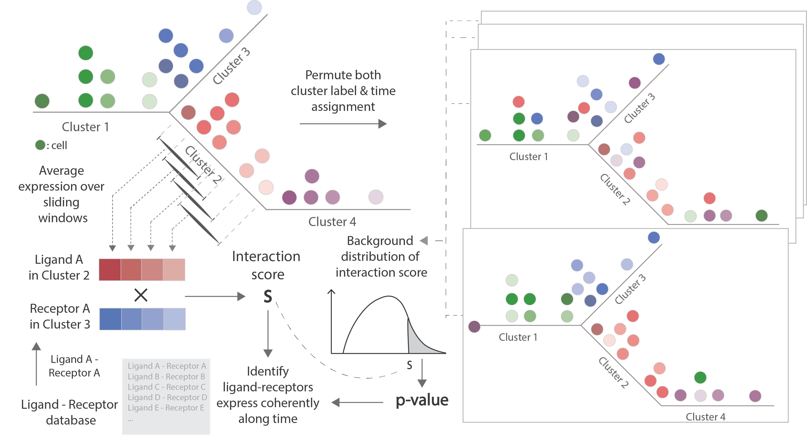

# Introduction
TraSig (**Tra**jectory-based **Sig**nalling genes inference) identifies interacting cell types pairs and significant ligand-receptors based on the expression of genes as well as the *pseudo-time ordering* of cells. For any two groups of cells that are expected to overlap in time, TraSig takes the pseudo-time ordering for each group and the expression of genes along the trajectory as input and then outputs an interaction score and p-value for each possible ligand-receptor pair. It also outputs a summary score for cell type pairs by combining individual ligand-receptors' scores. 



## Table of Contents
- [Get started](#Get&nbsp;started)
- [Command-line tools](#Command-line)
- [Prepare input](#Tutorials)

# Get started 
## Prerequisites 
* Python >= 3.6
* Python side-packages:   
-- numpy >= 1.19.5  
-- pandas >= 0.23.4  
-- Bottleneck >= 1.3.2  

## Installation 

### Install within a virtual environment 

It is recommended to use a virtural environment/pacakges manager such as [Anaconda](https://www.anaconda.com/). After successfully installing Anaconda/Miniconda, create an environment by following: 

```shell
conda create -n myenv python=3.6
```

You can then install and run the package in the virtual environment. Activate the virtural environment by: 

```shell
conda activate myenv
```

Make sure you have **pip** installed in your environment. You may check by 

```shell
conda list
```

If not installed, then: 

```shell
conda install pip
```

Then install TraSig, together with all its dependencies by: 

```shell
pip install git+https://github.com/doraadong/TraSig.git
```

If you want to upgrade TraSig to the newest version, then first uninstall it by:

```shell
pip uninstall trasig
```
And then just run the pip install command again. 

### Not using virtural environment

If you prefer not to use a virtual envrionment, then you may install TraSig and its dependencies by (may need to use **sudo**): 

```shell
pip3 install git+https://github.com/doraadong/TraSig.git
```

You may find where the package is installed by:
 
```shell
pip show trasig
```

# Command-line 

Run TraSig by (arguments are taken for example): 

```shell
main.py -i input -o output -d oligodendrocyte-differentiation-clusters_marques -g None -b ti_slingshot -n 100
```
The usage of this command is listed as follows:  

```shell
usage: main.py [-h] -i INPUT -o OUTPUT -d PROJECT -g PREPROCESS -b MODELNAME
               [-t LISTTYPE] [-l NLAP] [-m METRIC] [-z NAN2ZERO] [-n NUMPERMS]
               [-p MULTIPROCESS] [-c NCORES] [-s STARTINGTREATMENT]

optional arguments:
  -h, --help            show this help message and exit
  -i INPUT, --input INPUT
                        string, folder to find inputs
  -o OUTPUT, --output OUTPUT
                        string, folder to put outputs
  -d PROJECT, --project PROJECT
                        string, project name
  -g PREPROCESS, --preprocess PREPROCESS
                        string, preprocessing steps applied to the data /
                        project, default None
  -b MODELNAME, --modelName MODELNAME
                        string, name of the trajectory model
  -t LISTTYPE, --listType LISTTYPE
                        string, optional, interaction list type, default
                        ligand_receptor
  -l NLAP, --nLap NLAP  integer, optional, sliding window size, default 20
  -m METRIC, --metric METRIC
                        string, optional, scoring metric, default dot
  -z NAN2ZERO, --nan2zero NAN2ZERO
                        boolean, optional, if treat nan as zero, default True
  -n NUMPERMS, --numPerms NUMPERMS
                        integer, optional, number of permutations, default
                        10000
  -p MULTIPROCESS, --multiProcess MULTIPROCESS
                        boolean, optional, if use multi-processing, default
                        True
  -c NCORES, --ncores NCORES
                        integer, optional, number of cores to use for multi-
                        processing
  -s STARTINGTREATMENT, --startingTreatment STARTINGTREATMENT
                        string, optional, way to treat values at the beginning
                        of an edge with sliding window size smaller than nLap,
                        parent (need to provide also
                        'path_info.pickle')/discard/smallerWindow, default
                        None
```

# Prepare input 
To run TraSig, we need to have 3 input files. Here is a tutorial(tutorials/Prepare_input_from_dynverse_ti_methods.ipynb), showing how to prepare these files from the inference results by running various trajectory inference methods using [dynverse](https://dynverse.org/).

# Credits
The software is an implementation of the method TraSig, jointly developed by Dora Li, [Jun Ding](https://github.com/phoenixding) and Ziv Bar-Joseph from [System Biology Group @ Carnegie Mellon University](http://sb.cs.cmu.edu/).  

# Contacts
* dongshul at andrew.cmu.edu 

# License 
This project is licensed under the MIT License - see the [LICENSE](LICENSE) file for details

